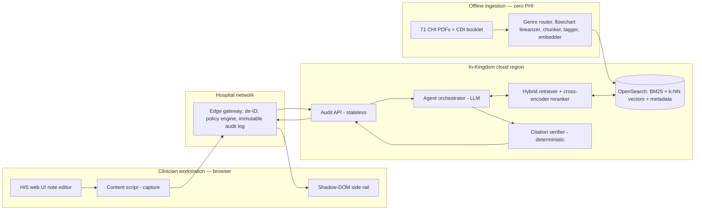
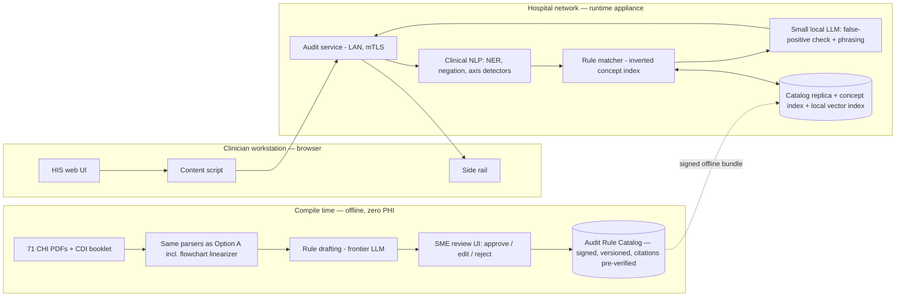

# Real-Time Clinical Documentation Audit Assistant — MVP Technical Proposal

**Prepared for:** CDI programme, KSA
**Date:** 2026-08-24
**Corpus analyzed:** `d:\CDI` — 71 CHI guideline PDFs (139 MB) + *CDI Course Booklet – Clinicians* (The Coding Company, 2021, ~368K chars extracted)
**Status:** Draft for review

---

## 0. Assumptions

These would have been clarifying questions; each is stated so it can be cheaply reversed before implementation. Where an assumption forks the architecture, both forks are covered by the two options below.

| # | Assumption | Basis | If wrong |
|---|---|---|---|
| A1 | **HIS surface is mixed**: TrakCare, VIDA, and most local vendors render in a browser; Cerner PowerChart and Epic Hyperspace/Hyperdrive are thick clients a browser extension cannot see. The MVP targets web-rendered HIS only and states per-platform coverage honestly (§3.5.6). | KSA market reality: TrakCare is fully HTML5; VIDA is web-delivered; Oracle Health/Cerner and Epic desktop clients are not browser-extensible. | If the pilot site is thick-client-only, the capture layer moves to an OS-level UI Automation companion app — the backend of either option is unchanged (§3.5.6). |
| A2 | **Primary audit objective is documentation specificity & completeness** (CDI-booklet-driven), with **medical-necessity checks as a secondary finding class** (CHI-criteria-driven). CBAHI process-quality checks (contemporaneity, signatures, timing) are post-MVP. | The booklet defines an enumerable specificity taxonomy (type, stage, agent, onset, site); the CHI corpus contains explicit medical-necessity criteria documents. These two are automatable from the provided sources; CBAHI process checks mostly need EHR metadata the extension cannot see. | Re-weighting finding classes is configuration, not architecture. |
| A3 | **No ICD-10-AM/ACHI licence is assumed at MVP.** Verified by corpus scan: the string `ICD-10-AM` appears **0 times** across both sources; `ACHI` 5 times; `NPHIES` 0 times. The codes your brief asks for as chunk metadata **cannot be derived from these documents** — they require the IHACPA-licensed code set CHI has adopted for NPHIES claims. The metadata schema carries empty code slots that a licensed terminology fills post-MVP without re-ingestion (§2.3). | Corpus grep, 2026-08-24. | If a licence exists, code binding activates as an extra ingestion stage; schema unchanged. |
| A4 | **Notes are English-dominant with Arabic fragments** (Saudi clinical convention); the corpus is English. Embedding and de-identification choices below are made to survive Arabic/English code-switching. | Standard KSA clinical practice. | None — the choices already accommodate it. |
| A5 | **Pilot scope:** 1–2 hospitals, 10 high-DRG-impact conditions (sepsis, pneumonia, CKD, diabetes, heart failure, anemia, malnutrition, respiratory failure, UTI, fractures), 3 note types (admission note, progress note, discharge summary). | Matches booklet coverage and where CDI ROI concentrates. | Scope dial, not architecture. |
| A6 | **The assistant is read-only.** It never writes into the note. Suggested compliant phrasing is offered copy-to-clipboard; the clinician authors every word. | Medico-legal: the clinician must remain sole author; also avoids catastrophic rich-text-editor interference across vendors. | Firm recommendation — reversing it needs legal review, not engineering. |
| A7 | **Necessity findings trigger from free text only** ("plan: MRI L-spine"), not from CPOE order feeds — the MVP has no HIS integration by requirement, so structured orders are invisible. | Hard requirement: HIS-agnostic, no per-vendor work. | FHIR/NPHIES order integration is the post-MVP path. |

---

## 1. What the corpus actually contains — and why it shapes the design

The two sources are not one homogeneous "guideline pile." Direct inspection shows **four genres with very different machine-readability**, and ingestion must treat them differently:

| Genre | Examples | Extraction behaviour | Consequence |
|---|---|---|---|
| **Flowchart CPGs** (majority of the CHI PDFs) | *Diabetes Mellitus* (8.1K chars), *Hypertension* (12.5K chars) | `pdftotext` yields spatially scrambled decision boxes — the words survive, the **decision logic does not** | Naive text chunking destroys the clinical meaning. These must be **linearized by a vision model at ingestion** (§3.2) |
| **Medical-necessity criteria** | *Medical Necessity Criteria for HgA1c Testing*, *Low Back Pain MRI*, *Vitamin B12 Testing* | Clean criterion lists | Map almost 1:1 to necessity-check rules |
| **Long-form standards** | *Saudi Stroke Standards* (239K chars), *Manual in Emergency Medicine*, Protocols 005–009 | Conventional prose + tables | Standard hierarchical chunking works |
| **CDI booklet** | Single 368K-char textbook | Clean 3-level TOC: Specialty → Condition → Rule; defines the five specificity axes — **type, stage, agent, onset, site** — with worked vocabularies per axis (p. 62–63) | This is an **enumerable rule source**, not just retrieval fodder. It can drive a deterministic audit layer — the entire premise of Option B |

All 72 files carry a text layer — **no OCR tier is required**, removing a whole class of ingestion cost and error.

Two further corpus facts with design consequences:

1. **The specificity taxonomy is closed.** The booklet's *Documenting for Specificity* chapter defines exactly five axes with example vocabularies (e.g., onset: *new, hospital-acquired, community-acquired, recurrent, sequela of, congenital, progressive…*). A closed taxonomy means specificity auditing reduces to: *for each documented condition, which axes are present, which are absent, and which absent axes matter for this condition* — a structured check, not an open-ended generation task. Both options exploit this.
2. **No code set exists in the corpus** (assumption A3). Every finding therefore cites a **guideline clause**, never a code, at MVP. This is also the more defensible posture: the audit trail points at authoritative text the hospital and CHI actually endorse.

---

## 2. Contracts shared by both options

Defining these once keeps the two options genuinely comparable — and gives the recommendation in §6 its migration path.

### 2.1 The finding schema

Every audit result, regardless of which architecture produced it, is an instance of:

```json
{
  "finding_id": "f_8a31…",
  "type": "specificity_gap | completeness_gap | necessity_mismatch | internal_conflict",
  "severity": "info | recommended | required",
  "evidence": { "note_excerpt": "CKD, on regular follow-up", "char_range": [412, 437] },
  "gap": {
    "axis": "stage",
    "condition_concept": "chronic kidney disease",
    "statement": "CKD is documented without stage; staging (1–5) is required for specificity."
  },
  "recommendation": "Document the CKD stage (e.g., 'CKD stage 4') and its basis (eGFR).",
  "citations": [{
    "clause_id": "CDI-2021/InternalMedicine/CKD/p2",
    "doc": "CDI Course Booklet – Clinicians (2021)",
    "section_path": ["Clinical Conditions", "Internal Medicine", "Chronic Kidney Disease (CKD)"],
    "page": 119,
    "quote": "<verbatim sentence(s) from the source>"
  }],
  "confidence": 0.93,
  "audit_cycle": "c_2201",
  "dedupe_key": "ckd|stage|note_74"
}
```

### 2.2 The citation contract — the hallucination firewall

**A finding without at least one *verified* citation is dropped before it reaches the UI.** Verification is deterministic, not model-based: the `quote` must match the stored source chunk at ≥ 0.95 normalized similarity (whitespace/ligature/diacritic-tolerant). A model may *draft* a citation; only string-matching against the ingested corpus can *confirm* it. This one rule converts "the LLM might invent a guideline" from a clinical-safety hazard into a recall loss — a silently dropped finding, never a fabricated one. Both options implement the identical verifier; they differ only in *when* it runs (Option A: every query, at runtime; Option B: once per rule, at compile time).

### 2.3 Clause IDs and the metadata schema

Every chunk (Option A) and every rule (Option B) carries a stable citation anchor plus clinical-structure metadata:

```
clause_id:  {SOURCE}-{DOC}/{section-path}/{para|box}
            e.g.  CHI-DM/BOX1        CDI-2021/Specificity/Onset/p3

metadata: {
  source_id, doc_title,
  authority: "CHI" | "MOH" | "TCC",
  genre: "flowchart_cpg" | "necessity_criteria" | "standard" | "cdi_rule",
  specialty: [...],                                  // from document + TOC section
  care_setting: "inpatient" | "outpatient" | "ED" | "any",
  applies_to_doc_types: ["admission_note", "progress_note", "discharge_summary", ...],
  section_path: [...], page,
  concepts: [...],                                   // extracted clinical concept terms
  icd10am_codes: [], achi_codes: [],                 // empty at MVP — licence-gated (A3)
  version_hash, effective_date
}
```

`specialty`, `care_setting`, and `applies_to_doc_types` are assigned per document/section during ingestion (LLM-assisted, SME-spot-checked). This is what makes retrieval *filterable by clinical context* — the difference between "semantically similar text" and "a clause that actually governs this note."

Clause IDs are anchored to section paths, not character offsets, so re-chunking and document revisions do not invalidate historical citations.

### 2.4 PHI capture policy (extension-level, identical in both options)

- The extension reads **only the text of the actively edited clinical narrative field**. It never scrapes the surrounding DOM — no patient banner, no MRN, no demographics, no screenshots. It reads field values on quiescence; it does not keylog.
- Host permissions are restricted at deployment to the hospital's HIS URL patterns via managed browser policy — the extension is structurally inert on every other site.
- Audit traffic is pseudonymous (`session_id`, rotated daily); neither user identity nor patient identity is attached.

---

## 3. Option A — "Sentinel": runtime agentic RAG, hosted in-Kingdom

**One sentence:** a thin capture extension feeds an on-prem de-identification gateway, which feeds an agentic RAG service in an in-Kingdom cloud region; a frontier-class LLM reasons over hybrid-retrieved guideline clauses at query time and returns citation-verified findings in 2–4 s.

### 3.1 Architecture



| Component | Runs | Responsibility |
|---|---|---|
| Content script + side rail | Browser | Field capture, debounce, finding display (§3.5) |
| Edge gateway | Hospital DMZ (container) | De-identification, egress policy, per-request immutable audit log, session auth |
| Audit API | Cloud | Stateless request handling; no note persistence |
| Agent orchestrator | Cloud | Assertion extraction, tool loop, finding composition (§3.4) |
| Hybrid retriever + reranker | Cloud | §3.3 |
| Index | Cloud | Guideline chunks + embeddings + metadata (contains zero PHI, ever) |
| Citation verifier | Cloud | §2.2 firewall |
| Ingestion pipeline | Offline / CI | §3.2; runs on corpus updates only |

### 3.2 Ingestion & chunking

**Genre router first.** Each PDF is classified (page count, text density, image ratio, filename heuristics + one LLM call) into the four genres of §1, then processed per genre:

1. **Flowchart CPGs — vision-model linearization.** Each page renders at ~200 DPI; a vision-capable frontier model transcribes the flowchart into ordered decision units: `{step, condition/branch, thresholds, action, box_ref}`. This is legitimate even under the strictest privacy posture — the corpus is public clinical guidance containing zero PHI, so frontier models are usable here *in both options*. Output is emitted twice: (a) as readable "decision clause" prose chunks for retrieval (`IF initial presentation with BG >300 mg/dL or A1C >10% THEN consider insulin…` with `clause_id: CHI-DM/BOX1`), and (b) as structured rule JSON reused by Option B. A clinical SME reviews the linearizations — at mostly 1–4 flowchart pages per document across 71 documents this is roughly **two SME days**, and it is the single highest-leverage quality investment in the whole pipeline, because these chunks carry the actual clinical logic.
2. **Medical-necessity criteria** → criterion-level chunks: one criterion per chunk with the parent indication header prepended, so each chunk is self-contained for the reranker.
3. **Long-form standards** → heading-hierarchy chunking, 300–700 token target, ~15% overlap, full section-path header prepended to every chunk (contextual chunking); tables kept atomic and never split.
4. **CDI booklet** → TOC-driven chunking at leaf-section granularity (the TOC is clean and 3-level, verified). The *Documenting for Specificity* chapter is additionally **compiled into axis vocabularies** (`onset: [new, hospital-acquired, community-acquired, recurrent, sequela, congenital, progressive, …]`) consumed by the agent's specificity tool — the booklet functions as both retrieval corpus and configuration.

Every chunk gets §2.3 metadata. Tagging (specialty, care setting, applicable doc types) is LLM-assisted with a 10% SME spot-check. Ingestion is idempotent and versioned by document hash; a guideline revision re-ingests one document and bumps `effective_date` without touching clause IDs.

### 3.3 Retrieval design

- **Embedding model: BGE-M3.** Chosen for three reasons that outrank raw MTEB rank: (1) genuinely multilingual — it survives the Arabic/English code-switching of Saudi notes, which English-only biomedical embedders (e.g., MedCPT) do not; (2) dense + sparse (learned lexical) representations from one model; (3) open weights — the *identical* retrieval stack runs on-prem in Option B, so evaluation work transfers between options instead of being redone. Hosted-only alternatives (e.g., voyage-3-large) score marginally higher on English retrieval but forfeit portability; rejected.
- **Hybrid, not vector-only.** Clinical audit queries are dense with exact terms — drug names, thresholds ("A1C >10%"), staging tokens ("stage 4") — where BM25 outperforms embeddings, while paraphrased clinical narrative needs dense retrieval. One OpenSearch index serves both; results fuse via reciprocal rank fusion. **Metadata pre-filtering is mandatory, not optional:** `applies_to_doc_types` must match the note type, and specialty match soft-boosts — this converts "similar text" into "governing clause."
- **Reranking:** `bge-reranker-v2-m3` cross-encoder over the fused top-50, keeping top-8 per query. Same open-weights portability argument.
- **Query formation.** The agent never dumps the raw note at the retriever. It issues targeted queries per auditable assertion — e.g., note text "CAP, started ceftriaxone" produces queries like *"community acquired pneumonia documentation requirements causative organism"* and *"pneumonia severity assessment criteria"*, each with metadata filters set from context.
- **From retrieved clause to actionable finding.** A retrieved clause is never itself a finding. The mapping is: *(note assertion + detected gap) × (clause that governs it) → finding*. For the specificity class the gap is detected **deterministically** (axis absent from the assertion, per the condition–axis matrix compiled from the booklet); retrieval's job is to supply the *authority and phrasing* — the citation — not the detection. For necessity findings the clause supplies the criteria list and the agent checks documented indications against it. This split (deterministic detection where possible, retrieval for authority, generation only for phrasing) is what keeps findings concrete instead of "consider reviewing the guideline."

### 3.4 Agent / orchestration layer

Each audit cycle (one debounced capture) runs:

1. **Assertion extraction** — one structured-output LLM call over the (de-identified) note text: conditions, procedures, planned/ordered investigations, negations ("no chest pain" must not trigger chest-pain guidance), and per-condition specificity axes present. This is the only step that reads the whole note.
2. **Deterministic pre-checks** — the condition–axis matrix runs in plain code: which conditions are missing which mandatory axes. Cheap, instant, no retrieval, no hallucination surface.
3. **Tool loop** — the agent has exactly four tools, all read-only:
   - `search_guidelines(query, filters)` — §3.3 hybrid retrieval
   - `get_clause(clause_id)` — exact clause fetch for citation assembly
   - `check_specificity(concept, axes_present)` — the compiled booklet matrix
   - `check_necessity(order_mention, documented_indications)` — criteria-doc lookup
4. **Finding composition** — constrained decoding against the §2.1 schema. The recommendation text is required to be phrased as a **non-leading query** consistent with CDI professional etiquette ("please document the stage if known", never "document stage 4") — leading queries are a compliance violation in their own right.
5. **Citation verification** — §2.2. Findings whose quotes fail string-match are dropped and logged for weekly review (a systematic verifier-failure pattern indicates a chunking bug, not a model bug).
6. **Session dedupe & resolution** — findings carry `dedupe_key`s; a finding disappears automatically when the gap text appears in the note, and a dismissed finding is not re-raised in the same session.

**Model:** a frontier-class model via an in-Kingdom endpoint where available; otherwise Qwen3-72B / Llama-3.3-70B-class open weights on in-region GPUs. The orchestration is model-agnostic by design (structured outputs + tools only — no provider-specific features).

**Hallucination containment, summarized:** grounded-retrieval-only prompting (the system prompt forbids citing memory), structured outputs everywhere, deterministic detection for the highest-volume finding class, string-verified citations (§2.2), confidence gating (findings below threshold are suppressed), severity `required` permitted only when backed by an explicit criteria clause, and a full finding→clause audit log so every alert ever shown is reconstructible — which is also exactly what a CBAHI surveyor will ask for.

**Latency budget (p50):** capture debounce 2.0 s → gateway de-ID ~100 ms → network ~100 ms → assertion extraction ~800 ms → retrieval + rerank ~300 ms → composition ~800 ms → verify + return ~100 ms ≈ **2.2 s after typing pauses** (p95 ≈ 4–5 s). Findings arrive while the clinician is still writing the next sentence — real-time in the sense that matters.

### 3.5 Browser extension design

This section applies to **both options** (Option B changes only the endpoint, §4.5).

**3.5.1 Capture strategy.** Manifest V3; content scripts injected with `all_frames: true` under host permissions restricted to the hospital's HIS URL patterns (pushed by policy — see 3.5.5). The script identifies *clinical narrative fields* heuristically: editable surface (`textarea`, `[contenteditable=true]`, large text inputs) + rendered-size threshold + free-text character (not a pick-list or search box). On `focusin` of a qualifying field it attaches listeners; it captures the **field's text value only** (§2.4).

**3.5.2 DOM-agnostic approach — and its honest limits.** There are zero vendor-specific selectors in code. Vendor variance is absorbed in two layers: (a) the heuristics above, which already cover plain textareas and every mainstream rich-text editor (CKEditor, TinyMCE, ProseMirror & co. all render `contenteditable` regions), with a MutationObserver on the editable subtree catching text that arrives without input events — dictation insertions (Dragon), template/smart-phrase expansions, programmatic writes; and (b) an optional **per-site field allowlist in managed-storage config** for a field the heuristic misses or mis-includes. Config is pushed by IT policy — tuning a deployment is a JSON change, not a code release, which is what keeps the hard "no per-vendor integration work" requirement true in practice. Same-origin and cross-origin iframes are both covered (content scripts inject per-frame under host permissions).

**3.5.3 Debounce / trigger logic.**
- Trigger on **2 s typing idle**, or **sentence terminator + 400 ms** (findings on completed clinical statements feel responsive without firing mid-word).
- Suppress if fewer than ~40 chars changed since the last audited snapshot.
- **Latest-wins:** new input cancels the in-flight request.
- Full-field re-audit on `blur` (the "about to sign" moment — highest-value audit point).
- Hard rate cap ~1 request / 5 s / field.

**3.5.4 Surfacing — the non-intrusive UX.** The interaction model is deliberately the **spell-checker mental model**: ambient, glanceable, ignorable.

- A **shadow-DOM side rail** on the right edge (shadow DOM: HIS CSS cannot break it, it cannot break HIS). Default state: collapsed to a 24 px strip showing only severity-tinted count badges.
- Expands on click into **finding cards**: gap statement → suggested compliant phrasing with a **copy button** (copy, never auto-insert — assumption A6) → citation, expandable to the verbatim clause and source page.
- Optional **inline underlines** under evidence spans via the CSS Custom Highlight API — it paints ranges without mutating the editor's DOM, which is the only safe way to decorate text inside an editor you don't own. Degrades to rail-only where unsupported.
- **Never-list (hard commitments):** no modals, no toasts that steal focus, no sounds, no auto-insertion, no blocking of save/sign, no interruption of typing. One-click dismissal, remembered per session; per-user "quiet mode" leaving only the badge count.

*Justification:* clinicians already run exactly this grammar — squiggles + margin count — dozens of times a day in Word and Outlook; it is the one audit-feedback pattern with proven non-intrusiveness. The blur-triggered full audit concentrates attention at the natural checkpoint (finishing the note) rather than fighting for it mid-thought. And phrasing recommendations as non-leading queries keeps the tool inside established CDI professional practice, which is what makes clinical governance committees approve it.

**3.5.5 Enterprise lifecycle.** Force-installed via `ExtensionInstallForcelist` (Chrome/Edge group policy); configuration (HIS URL patterns, endpoint, field allowlists, feature flags) via managed storage. No user-visible install or update flow.

**3.5.6 Where it breaks — honest coverage map.**

| Surface | Coverage | Why |
|---|---|---|
| InterSystems TrakCare (web/HTML5) | ✅ | Standard DOM in browser |
| VIDA (web-delivered) | ✅ | Standard DOM in browser |
| Local KSA vendors (web) | ✅ mostly | Heuristics + per-site config absorb variance |
| Oracle Health / Cerner web modules | ⚠️ partial | Web modules covered; documentation often lives in PowerChart |
| Cerner PowerChart (Win32 thick client) | ❌ | No DOM exists for a browser extension |
| Epic Hyperspace / Hyperdrive | ❌ | Hyperdrive is a Chromium *shell* that does not load user extensions |
| Browser running **inside** Citrix/VDI | ✅ | Extension installs into the VDI golden image via the same GPO |
| Thick client inside Citrix | ❌ | Same as thick client |
| Canvas-rendered editors | ❌ | Text never exists in the DOM (rare in HIS, but real) |

**Mitigation path (post-MVP, not in scope):** a companion desktop agent using Windows UI Automation (the accessibility tree exposes text in PowerChart and most Win32/WPF apps), feeding the same gateway API. The backend of either option is untouched — this is precisely why the capture layer is a thin client with all intelligence behind a stable API.

### 3.6 Privacy & data flows

| Data | Leaves the browser? | Leaves the hospital network? | Notes |
|---|---|---|---|
| Active note field text | ✅ → edge gateway (in-hospital, TLS) | Only **after de-identification** | The only clinical payload |
| Patient banner, MRN, demographics, other DOM | ❌ never captured | ❌ | Structural exclusion (§2.4), not a filter |
| Keystroke timings, screenshots | ❌ never captured | ❌ | |
| De-identified note text + pseudonymous session ID | — | ✅ → in-Kingdom cloud | Processed statelessly; **never persisted** |
| Findings | returned to browser | cached ≤ 24 h keyed by pseudonym | For dedupe only |
| Guideline corpus & index | — | (lives in cloud) | Contains zero PHI by nature |
| De-ID audit log (what was redacted, per request) | — | ❌ stays on-prem | The hospital can prove exactly what left |

**De-identification (edge gateway):** Microsoft Presidio as the engine, extended with clinical patterns (MRN formats, Saudi national ID / iqama patterns, phone formats) and — flagged honestly — a **custom Arabic NER layer** (CAMeL-Tools/AraBERT-based) because off-the-shelf de-ID is materially weaker for Arabic names in Latin or Arabic script. Names/IDs/contacts are redacted, dates shifted per-session. **Residual risk stated plainly:** de-identification of free text is never perfect; rare leakage of a name fragment into the cloud tier is the principal PDPL risk of Option A, mitigated by (a) in-Kingdom processing only, (b) no persistence, (c) a data-processing agreement, (d) the on-prem redaction audit log. This is the risk a hospital DPO must explicitly accept — Option B exists for those who won't.

**PDPL posture:** health data is sensitive personal data under the PDPL (SDAIA-regulated); the design minimizes transfer (de-identified only), keeps processing in-Kingdom (no cross-border transfer questions), and keeps an on-prem evidentiary log. MOH/NHIC data-residency expectations are met by region choice; CBAHI's documentation-quality standards are *served* by the product rather than threatened by it — the finding→clause audit log doubles as surveyor evidence.

### 3.7 Deployment model & trade-off

- **Cloud tier:** in-Kingdom region — Google Cloud Dammam (me-central2) or Oracle Cloud Riyadh/Jeddah today; the announced AWS KSA region when live; or SDAIA-aligned sovereign hosts (STC/SCCC, HUMAIN) where procurement demands it. LLM: managed frontier endpoint if available in-region, else open-weights on in-region GPUs.
- **Hospital tier:** the edge gateway is one container (Docker/K8s) in the DMZ — deliberately boring to operate.
- **Trade-off in one paragraph:** Sentinel buys **maximum reasoning quality and iteration speed** (prompt/retrieval changes deploy centrally, daily; one index serves all sites; no per-site GPU estate) at the price of a **real, bounded privacy residual** (de-ID imperfection) and a hard dependency on customer legal sign-off. It is the fastest way to learn whether findings are good enough for clinicians to keep the rail open — which is the actual MVP question.

### 3.8 MVP scope, effort, team

**Scope:** assumption A5 (10 conditions, 3 note types) + 2 finding classes (specificity, necessity) + English-first with Arabic tolerance + 1 pilot site.

| Role | FTE | Weeks |
|---|---|---|
| Tech lead / backend (gateway, API, verifier) | 1.0 | 14 |
| ML engineer (ingestion, retrieval, agent) | 1.0 | 14 |
| Extension / front-end engineer | 1.0 | 12 |
| Clinical informaticist (CDI-certified) | 0.5 | 14 |
| DevOps / SRE | 0.3 | 14 |
| PM / clinical liaison | 0.5 | 14 |

**≈ 55–60 person-weeks, 12–14 calendar weeks.** Phasing: W1–3 ingestion + flowchart linearization (+SME review); W2–6 retrieval + agent loop; W3–8 extension; W5–8 gateway + de-ID; W9–11 integration + **offline validation against ~200 SME-labelled notes**; W12–14 pilot hardening.

**Acceptance gates before any clinician sees it:** finding precision ≥ 85% on the labelled set; median ≤ 5 findings per note; p50 latency < 4 s; dismissal-rate telemetry wired (the true north metric — a dismissed finding is a cost, not a catch).

---

## 4. Option B — "Rulebook": compile-time distillation, on-prem deterministic runtime

**One sentence:** instead of reasoning over retrieved text at query time, an offline compiler (frontier LLM + human review) transforms the entire corpus into a signed, versioned **Audit Rule Catalog**; runtime is an on-prem clinical-NLP + rule-matching service with a small local LLM used only for phrasing — nothing ever leaves the hospital network.

**Why this is a genuinely different architecture, not a variation:** Sentinel puts the intelligence at **query time** over retrieved text; Rulebook moves it to **build time**, where it is human-reviewed once, and makes runtime (near-)deterministic. The failure modes invert — Sentinel risks runtime hallucination and buys open-ended coverage; Rulebook makes fabricated findings structurally impossible and pays with a recall ceiling. The cost curves invert too: Sentinel is inference-heavy/curation-light, Rulebook is curation-heavy/inference-light. The corpus makes Rulebook *feasible*: 72 documents whose rule-bearing content is largely enumerable (§1) is a compilable knowledge base; a corpus of 10,000 documents would not be.

### 4.1 Architecture



### 4.2 Ingestion → compilation

Parsing, genre routing, and flowchart linearization are **identical to §3.2** (shared code). The difference is the target: instead of an embedding index, the pipeline drafts **audit rules**:

```
rule: {
  rule_id, version,
  triggers: { concepts: [...], context: {doc_types, care_setting, specialty} },
  requires: { axis: "agent", or: ["causative organism named", "culture pending documented"] },
  logic: "condition_present AND NOT axis_present(agent)",
  finding_template: { type, severity, gap_text, recommendation_text },
  citation: { clause_id, quote, page }   // string-verified at compile time
}
```

**Volume estimate (from the actual corpus):** CDI booklet ≈ 250–400 rules; flowchart CPGs ≈ 15–40 each; necessity docs ≈ 5–15 each; long-form standards contribute selectively → **≈ 1,500–2,500 rules total**. At 2–4 minutes per rule review, that is **3–4 weeks of one full-time CDI specialist** in a purpose-built review UI (approve / edit / reject, citation shown side-by-side with source page). This cost is real and is Rulebook's main schedule risk — stated plainly rather than hidden.

Because every rule's citation is string-verified **at compile time**, a fabricated citation at runtime is not merely guarded against — it is *structurally impossible*: runtime never generates citations, it emits pre-verified ones.

### 4.3 Retrieval design (per the brief — where embeddings live in a rule-first system)

- **Compile time:** BGE-M3 embeddings (same model as Option A — shared evaluation) power rule **de-duplication** and **coverage mapping** (which corpus sections produced no rules — a to-do list for the SME).
- **Runtime:** the finding path uses **no similarity search at all** — concept-set → inverted-index rule matching, which is exact, fast, and explainable. A local vector index (Qdrant + BGE-M3 on the appliance) serves only the "show me the underlying guideline" expansion in the UI and an SME authoring search. Rationale: in a compiled system, similarity on the critical path would reintroduce exactly the fuzziness compilation was chosen to remove.

### 4.4 Runtime pipeline (the "agent layer" equivalent)

1. **Clinical NLP:** concept extraction + negation/uncertainty handling (medspaCy/ConText-style) with a custom vocabulary, or a fine-tuned small model (Qwen3-4B/8B-class) doing assertion extraction as structured output — same output shape as Sentinel's step 1, swappable.
2. **Axis detectors:** the booklet's five specificity axes as pattern/dependency detectors (closed vocabularies, §1) — deterministic.
3. **Rule matcher:** concept set × context filters → fired rules → findings pre-formed from templates.
4. **Small local LLM (7–8B, one L40S/A10-class GPU — or CPU-only with a 4B model at reduced throughput):** two constrained jobs only — (a) a false-positive check ("does the note genuinely lack this element?" — catches NER misses, e.g., stage documented in an unusual phrasing), and (b) surface phrasing within the template. It cannot add findings, change severity, or touch citations.

**Latency: ~300–800 ms end-to-end on-LAN** — comfortably inside a more aggressive trigger policy than Sentinel can afford.

**Reasoning trade-off stated honestly:** Rulebook cannot handle what no rule anticipates — unusual phrasings the NLP misses, rare conditions outside the catalog, cross-assertion inconsistencies ("afebrile, on antipyretics" style conflicts) that Sentinel's frontier model would catch. Its recall ceiling *is* the catalog. Its precision, however, is typically higher, and every possible finding is enumerable in advance — a property clinical governance committees and CBAHI surveyors actively prefer, because the system can be *audited before deployment* rather than only monitored after.

### 4.5 Browser extension

Identical capture, heuristics, debounce, and side-rail UX to §3.5. Deltas: endpoint is the **on-LAN appliance** (mTLS, hospital PKI); an **offline queue** lets documentation-time auditing survive WAN outages (there is no WAN dependency at all); the tighter latency budget enables sentence-level triggering by default. The honest coverage map of §3.5.6 applies unchanged — capture physics do not care where the backend lives.

### 4.6 Privacy & data flows

| Data | Leaves the browser? | Leaves the hospital network? |
|---|---|---|
| Active note field text | ✅ → on-LAN appliance only | ❌ **never** |
| Anything else | ❌ | ❌ |
| Catalog updates (inbound) | — | signed offline bundles, AV-definition style |
| Telemetry (optional, outbound) | — | aggregate counts only, PHI-free, and only if the hospital opts in |

No de-identification tier is needed because there is no egress. PDPL/MOH/NHIC posture is trivially clean; the design is procurable by sovereign-cluster and air-gapped environments (MOH clusters, military/national-guard health systems) where Option A is a non-starter regardless of its safeguards.

### 4.7 Deployment model & trade-off

Per-hospital appliance: one GPU VM (or two for HA), Helm chart or docker-compose, hospital PKI, signed catalog bundles for updates. **Trade-off in one paragraph:** Rulebook buys **absolute privacy, sub-second latency, offline resilience, and pre-auditable behaviour** at the price of a **permanent editorial function** (the catalog is a living clinical asset that must track guideline revisions), a **recall ceiling**, and **per-site operations** that scale linearly with fleet size. It is the right shape for sovereign procurement and the wrong shape for discovering, quickly, whether your finding quality is good enough — iteration cycles run through SME review, not a prompt change.

### 4.8 MVP scope, effort, team

Same clinical scope (A5). Catalog restricted to the 10 pilot conditions + necessity criteria docs (≈ 400–700 rules for MVP, not the full 2,500).

| Role | FTE | Weeks |
|---|---|---|
| Tech lead / backend (appliance, matcher, bundles) | 1.0 | 18 |
| ML/NLP engineer (clinical NLP, compiler, local LLM) | 1.0 | 18 |
| Extension / front-end engineer | 1.0 | 12 |
| CDI specialist (rule review — the critical path) | 1.0 | 10 |
| DevOps (appliance packaging) | 0.4 | 18 |
| PM / clinical liaison | 0.5 | 18 |

**≈ 80–90 person-weeks, 16–20 calendar weeks.** The compiler and review UI land early (W1–6) so SME review (W5–12) overlaps engineering. Same acceptance gates as §3.8, plus: catalog coverage report published per release (which conditions/doc-types are covered — **no silent gaps**).

---

## 5. Decision matrix

Scores 1–5, higher is better (for cost/risk rows, higher = cheaper/safer).

| Criterion | A — Sentinel | B — Rulebook | Notes |
|---|:---:|:---:|---|
| Time-to-MVP | **4** | 2 | 12–14 w vs 16–20 w; B's critical path is SME review, which compresses poorly |
| HIS coverage breadth | **3** | **3** | Identical — coverage is set by capture physics (§3.5.6), not by backend choice |
| Clinical accuracy | **4** | 3 | A: frontier reasoning catches novel phrasing and cross-assertion conflicts; B: higher precision but a hard recall ceiling. Both sit behind the same citation firewall |
| Privacy risk | 3 | **5** | A: de-ID residual + in-Kingdom cloud, needs DPO sign-off; B: zero egress, trivially clean |
| Infrastructure cost | **3** | 3 | A: central opex, no per-site hardware, scales smoothly. B: cheap at one site, linear appliance + ops cost per site at fleet scale |
| Maintenance burden | **3** | 2 | A: prompt/retrieval tuning, central; B: permanent rule-curation function + per-site upgrade logistics |
| **Total** | **20** | **18** | |

The totals are close because the options are good at *different things* — which is the point. The decision is really about which risk you need to retire first.

---

## 6. Recommendation

**Build Option A (Sentinel) for the MVP — with Option B's seams deliberately left in place.**

Reasoning:

1. **The MVP's riskiest assumption is not compliance — it is clinical usefulness.** The question that kills or validates this product is whether findings are accurate, specific, and infrequent enough that clinicians keep the side rail open after week two. Only frontier-grade reasoning tests the ceiling of that question, and only Sentinel's central deployment lets you tune findings daily during the pilot instead of routing every fix through rule review. Rulebook can tell you whether a *catalog* is good; Sentinel tells you whether the *product concept* is good.
2. **The compliance path for A exists and is concrete.** De-identified-only egress, in-Kingdom processing, zero persistence, and an on-prem redaction audit log is a package a private-sector hospital DPO can sign under the PDPL. Pilot with a private provider (where CHI/NPHIES denial pressure makes ROI sharpest and legal sign-off is one organization, not a cluster bureaucracy).
3. **A builds B while it runs.** This is the decisive architectural argument, and why §2 exists: both options share the finding schema, citation contract, clause IDs, parsers, and flowchart linearizations. Every SME-confirmed Sentinel finding is a labelled example of *(note pattern → gap → clause)* — which is precisely a draft Rulebook rule. The pilot doesn't just validate Option A; it **generates Option B's catalog** with real-world evidence attached, collapsing Rulebook's biggest cost.
4. **B is the productization path, not the loser.** MOH clusters, sovereign environments, and any tender that says "air-gapped" will require Rulebook's posture. The end-state portfolio is: **Sentinel for hosted-tolerant customers, Rulebook (seeded by Sentinel's validated findings) for sovereign ones** — one knowledge pipeline, two runtimes.

**Concrete sequencing:** Weeks 1–14, build and pilot Sentinel per §3.8. From week 8, persist SME-confirmed findings in Rulebook's rule format. Decision gate at week ~20: if pilot metrics hold (precision ≥ 85%, dismissal rate trending down, clinician retention of the rail), green-light the Rulebook appliance build for sovereign-market entry with a catalog already half-written.

---

*All corpus statistics in this document (document counts, character counts, term frequencies, TOC structure, flowchart extraction behaviour) were measured directly against the files in `d:\CDI` on 2026-08-24.*
